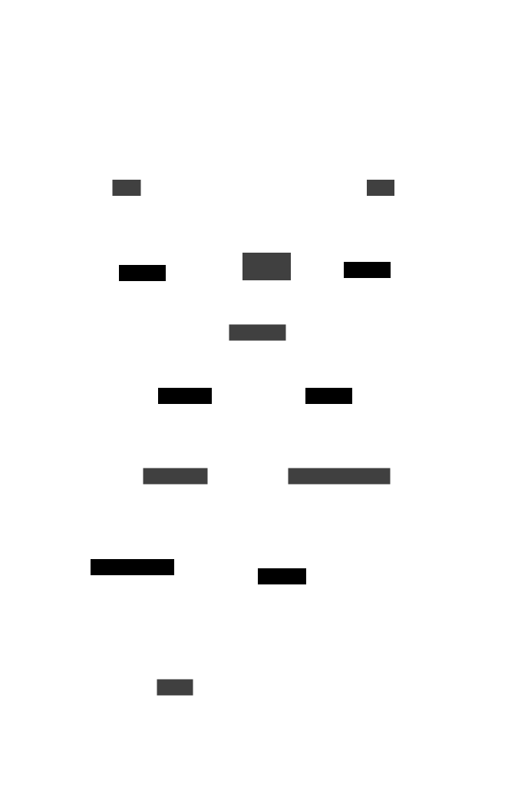

# Texel

**Texel** is an **API** for accessing geospacial information written in Go. It provides an extensive **Design Rule Engine** for validating GeoJSON collections.

## Quickstart

```bash
# Development mode
task run

# Release mode
GIN_MODE=release task run
```

### Prerequisites

We expect that the following binaries are available in your `PATH`.

  - [task](https://taskfile.dev/)
  - [swag](https://github.com/swaggo/swag)
  - [grafterm](https://github.com/slok/grafterm)
  - [jq](https://stedolan.github.io/jq/)
  - [curl](https://curl.haxx.se/)
  - [hyperfine](https://github.com/sharkdp/hyperfine/)
  - [stringer](golang.org/x/tools/cmd/stringer@latest)

Configured **CGO** is required for [go-sqlite3](https://github.com/mattn/go-sqlite3?tab=readme-ov-file#installation).


## A Tour of Texel

<!--  -->
<div align="center">
  
</div>

### Components

| Name                | Package                                                         | Domain            |
| ------------------- | --------------------------------------------------------------- | ----------------- |
| Controller          | [`pkg/controller/v1/project`](pkg/controller/v1/project/api.go) | JSON API          |
| Mnemosyne           | [`pkg/mnemosyne`](pkg/mnemosyne/sqlite.go)                      | Persistency Layer |
| Design Rule Engine  | [`pkg/construction`](pkg/construction/dre.go)                   | Business Logic    |

## Design Rule Violations

Package [`construction`](pkg/construction/dre.go) encompasses the vast majority of business logic. It validates every GetJSON collection as well as _the splits_.

| Violation Name                | Type          | Condition(s)
| ----------------------------- | ------------- |----------------------------------------------------------|
| DesignRuleViolationOverlapped | `Collection`  | if the polygons are overlapped                           |
| DesignRuleViolationNotClosed  | `Collection`  | if any polygon isn't closed                              |
| DesignRuleViolationNotPolygon | `Collection`  | if any collection has a non-polygon object               |
| DesignRuleViolationOutOfBound | `Split`       | if _building_limits_ **doesn't** contain _height_plateaux_   |

## Progress

  - [x] setup Gin
  - [x] [Structured Logging](https://learninggolang.com/it5-gin-structured-logging.html)
  - [x] `SQLite` setup
  - [x] `GeoJSON` setup
  - [x] GET building_limits
  - [x] GET height_plateaux
  - [x] PATCH building_limits
  - [x] PATCH height_plateaux
  - [x] GET split_building_limits
  - [x] [fix database is locked](https://www2.sqlite.org/cvstrac/wiki?p=DatabaseIsLocked)
  - [x] feat(mnemosyne): implement `updateObject`
  - [x] PATCH height_plateaux
  - [x] feat(design-rule-engine): implementation
  - [x] feat: integration tests
  - [x] *** Release 0.1.0.pre1 version ****
  - [x] test: concurrent update
  - [x] [Connect healthz to DB](https://pkg.go.dev/database/sql#example-package-OpenDBService)
  - [x] [Texel Architecture with D2](https://app.terrastruct.com/diagrams/2073737807) or [this](https://text-to-diagram.com/)
  - [x] docs: readme
  - [ ] Handle `ErrProjectNotFound` error
  - [ ] Prometheus Metrics
  - [ ] Grafterm dashboard
  - [ ] *** Release 0.1.0 version ****
  - [ ] test(design-rule-engine): unit tests
  - [ ] Postman
  - [ ] OpenAPI Specification with `Swag`
  - [ ] Database timeout via `context.Context`
  - [ ] Add CLI and ENV configuration routines
  - [ ] feat(logging): production ready
  - [ ] feat(deployment): dockerfile
  - [ ] feat(deployment): google cloud run
  - [ ] *** Release 0.2.0 version ****
  - [ ] feat(deployment): aws faregate
  - [ ] feat: dependency injection

## Contribution

```shell
#  List all tasks
task --list-all

# healthz-hyperfine:
# test-concurrency:
# test-happy-path:
# test-integration:
# test-stress:
# test-two-isles:
# test-two-isles-hyperfine:
```

### Before check-in the code checklist

  - [ ] Make sure all new source code files have the copyright header


## References

- [MPL2](https://www.mozilla.org/en-US/MPL/headers/)
- Logging
  - [V levels](https://github.com/kubernetes/community/blob/master/contributors/devel/sig-instrumentation/logging.md#what-method-to-use)
  - https://github.com/go-logr/zapr
  - https://github.com/go-logr/logr
  - https://github.com/uber-go/zap
- JSON API:
  - [Google JSON Style Guide](https://google.github.io/styleguide/jsoncstyleguide.xml)
  - [JSON API spec](https://github.com/json-api/json-api)
  - https://blog.logrocket.com/documenting-go-web-apis-with-swag/
  - https://medium.com/@isuru89/a-better-way-to-implement-http-patch-operation-in-rest-apis-721396ac82bf
- Gin:
  - https://gin-gonic.com/docs/examples/bind-uri/
- Deployment
  - [Google Functions](https://cloud.google.com/functions/docs/concepts/execution-environment#functions-concepts-scopes-go)
  - [Cloud Run](https://cloud.google.com/run/)
- [GeoJSON](https://en.wikipedia.org/wiki/GeoJSON)
- [GeoJSON standard - rfc7946](https://datatracker.ietf.org/doc/html/rfc7946)
- https://en.wikipedia.org/wiki/Design_rule_checking
- https://github.com/paulmach/orb/tree/master/planar
- [Euclidean Geometry](https://en.wikipedia.org/wiki/Euclidean_geometry)
  - https://en.wikipedia.org/wiki/Apeirogon
  - https://en.wikipedia.org/wiki/List_of_two-dimensional_geometric_shapes
  - https://en.wikipedia.org/wiki/Projected_coordinate_system
- GeoJSON deviation in [orb](https://github.com/paulmach/orb/issues/45)
- https://github.com/go-kit/kit
